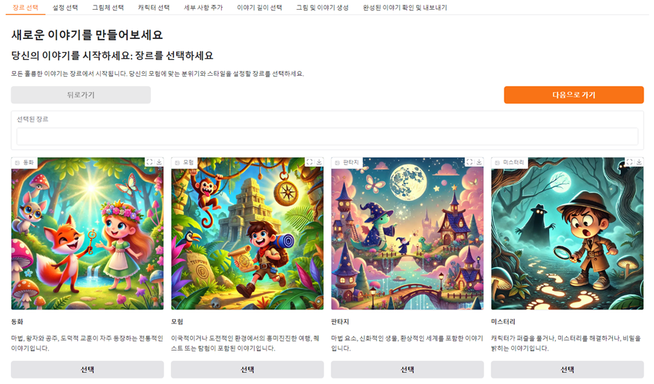
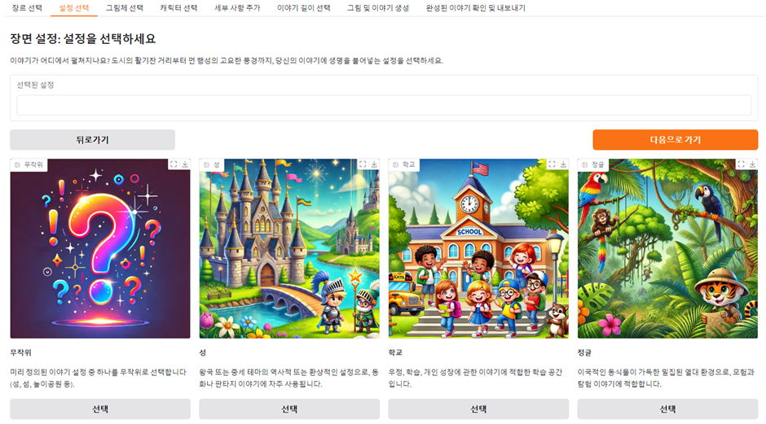
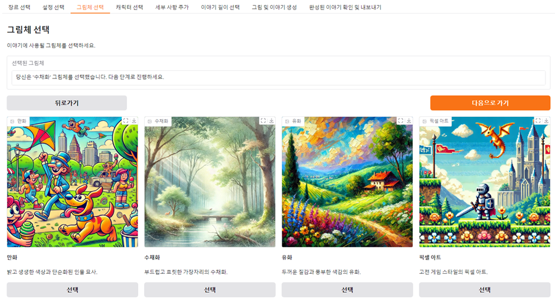
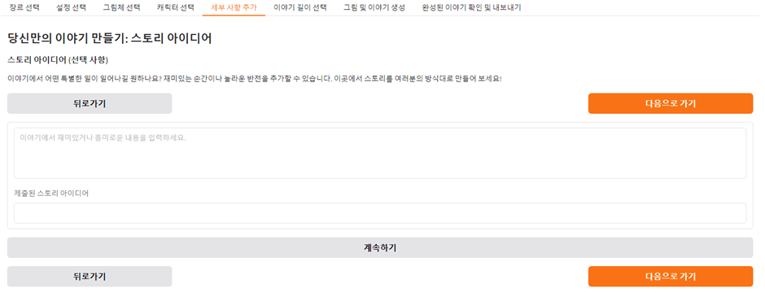
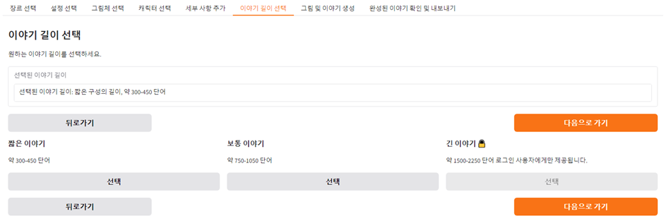
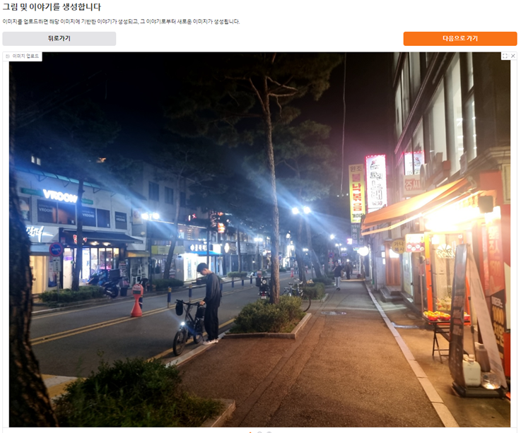
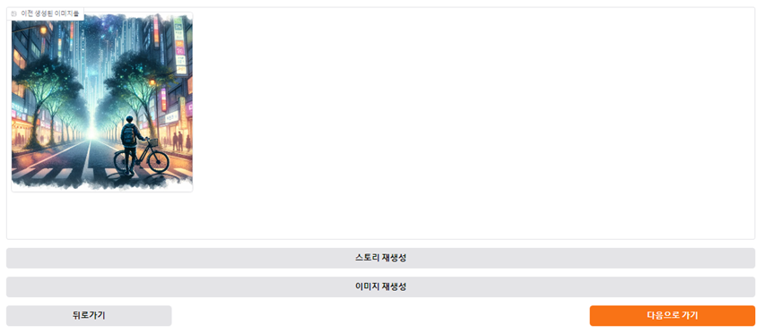

# AI-Based Interactive Story Creation Platform
[View in Korean](README.md)

This project is an AI-based interactive story creation platform that combines user-uploaded photos and imagination to create personalized stories and visualize them with AI-generated images.

## Key Features
1. **Photo Upload and Analysis**
   - Analyzes user-uploaded photos with AI to generate textual descriptions.
   - Utilized as prompts for story creation.

2. **Genre, Background, Art Style, and Character Settings**
   - Genres: Various options like fairy tale, fantasy, sci-fi, mystery.
   - Backgrounds: Specify desired settings like castles, forests, cities, space, etc.
   - Art Styles: Choose styles like cartoon, watercolor, pixel art, and more.
   - Characters: Freely set name, traits, age, gender, etc.

3. **Story Idea Input and Length Adjustment**
   - Provide story ideas or specific settings as inputs.
   - Choose story length, from short tales to lengthy epics.

4. **AI-Powered Story and Image Generation**
   - Generates customized stories using ChatGPT (LLM).
   - Creates story illustrations with tools like Stable Diffusion or DALL·E.
   - Regenerate feature ensures desired results.

5. **Sharing and Exporting Results (In Progress)**
   - Export completed stories and images as PDF or Word files.
   - Share via social media platforms like KakaoTalk, Twitter, etc.

---

## Installation and Execution

### Prerequisites
- Python 3.8 or higher must be installed.
- An OpenAI API key is required and must be added to the source code.

### Execution

#### Recommended: Use Google Colab
- It is recommended to run this program on Google Colab.
- Colab provides a hassle-free environment for running the project.
- To execute on Colab, follow these steps:
  1. Open the project notebook file in Colab.
  2. Set the API key.
  3. Execute the cells sequentially.
  4. Click the URL link to run it.


#### Run on PC (Using VSCode or Jupyter Notebook)
- To run on a PC, install the required packages using the `requirements.txt` file.
- Installation:
  ```bash
  pip install -r requirements.txt
  ```
- Then, run the project file on Jupyter Notebook or VSCode.
   1. Open the project file in Jupyter Notebook.
   2. Set the API key.
   3. Execute the cells sequentially to launch the interface.

---

## How to Use

### Step 1: Choose Genre
- Select your desired genre from the provided list.


### Step 2: Select Settings
- Choose the setting for your story's background.


### Step 3: Choose Art Style
- Select the art style for the generated images.


### Step 4: Choose Characters
- Input the protagonist’s name, gender, age, and traits or generate them randomly.


### Step 5: Input Story Idea
- Enter your story idea or skip this step.


### Step 6: Choose Story Length
- Select between a short story or a full-length narrative.


### Step 7: Generate Images and Story
- Upload photos to let the AI create stories and generate new images.
- Regenerate stories or images if needed.







### Step 8: Export and Share
- Export your generated stories and images as PDF or Word files, or share them via platforms like KakaoTalk and Twitter.


---

## Contribution
If you wish to contribute to this project, please report bugs or provide feedback through the Issues tab or submit a Pull Request (PR).

---

## License
This project is distributed under the [MIT License](LICENSE).