# AI 기반 인터랙티브 스토리 창작 플랫폼
[View in English](README.en.md)

본 프로젝트는 사용자가 사진과 상상력을 AI로 결합하여 개인화된 스토리를 창작하고, 이를 시각적 이미지로 재현하는 AI 기반의 인터랙티브 스토리 창작 플랫폼입니다.

## 주요 기능
1. **사진 업로드 및 분석**
   - 사용자 사진을 AI 모델로 분석하여 텍스트 묘사 생성.
   - 스토리 생성 프롬프트에 활용.

2. **장르·배경·그림체·캐릭터 설정**
   - 장르: 동화, 판타지, SF, 미스터리 등 다양.
   - 배경: 성, 숲, 도시, 우주 등 원하는 환경 지정.
   - 그림체: 만화풍, 수채화, 픽셀아트 등 스타일 선택.
   - 캐릭터: 이름, 특징, 나이, 성별 등 자유롭게 설정.

3. **스토리 아이디어 입력 및 길이 조정**
   - 사용자 입력 아이디어 또는 특정 설정 전달.
   - 짧은 단편부터 긴 서사까지 분량 선택.

4. **AI 기반 스토리·이미지 생성**
   - ChatGPT(LLM) 기반 맞춤형 스토리 자동 생성.
   - Stable Diffusion, DALL·E 등으로 스토리 삽화 자동 생성.
   - 재생성 기능으로 원하는 결과 도달 가능.

5. **결과물 공유 및 내보내기 (미완성)**
   - 완성된 스토리+이미지를 PDF, Word 형태로 다운로드.
   - 카카오톡, 트위터 등 SNS 공유 지원.

---

## 설치 및 실행 방법

### 사전 준비
- Python 3.8 이상이 설치되어 있어야 합니다.
- OpenAI API 키를 준비하여 소스코드에 입력해야 합니다.

### 실행

#### Google Colab 사용 권장
- 본 프로그램은 Google Colab에서 실행하는 것을 권장합니다.
- Colab에서는 추가적인 환경 설정 없이 간편하게 실행할 수 있습니다.
- Colab에서 실행하려면 다음 단계를 따르세요:
  1. Colab에서 프로젝트 노트북 파일을 엽니다.
  2. API 키를 설정합니다.
  3. 셀을 순차적으로 실행합니다.
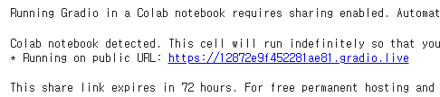
#### PC에서 실행 (VSCode 또는 Jupyter Notebook 사용)
- PC에서 실행하려면 `requirements.txt` 파일을 이용하여 필요한 패키지를 설치해야 합니다.
- 설치 방법:
  ```bash
  pip install -r requirements.txt
  ```
- 이후, 주피터 노트북 또는 VSCode에서 프로젝트 파일을 실행하세요.
   1. 주피터 노트북을 열고 프로젝트 파일을 실행합니다.
   2. API 키를 설정합니다.
   3. 각 셀을 순차적으로 실행하여 인터페이스를 실행합니다.

---

## 사용 방법

### 1단계: 장르 선택
- 제공된 장르 목록에서 원하는 장르를 선택하세요.
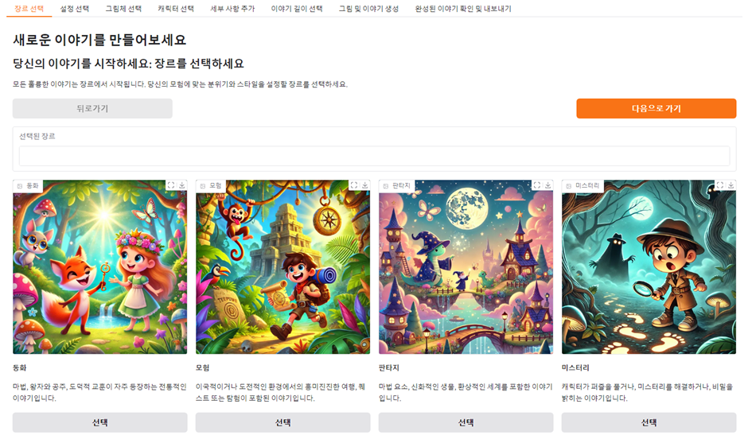

### 2단계: 설정 선택
- 이야기의 배경이 될 설정을 선택하세요.
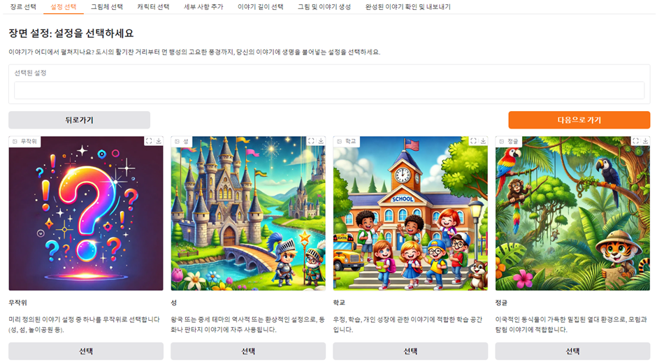
### 3단계: 그림체 선택
- 생성될 이미지의 그림체 스타일을 선택하세요.
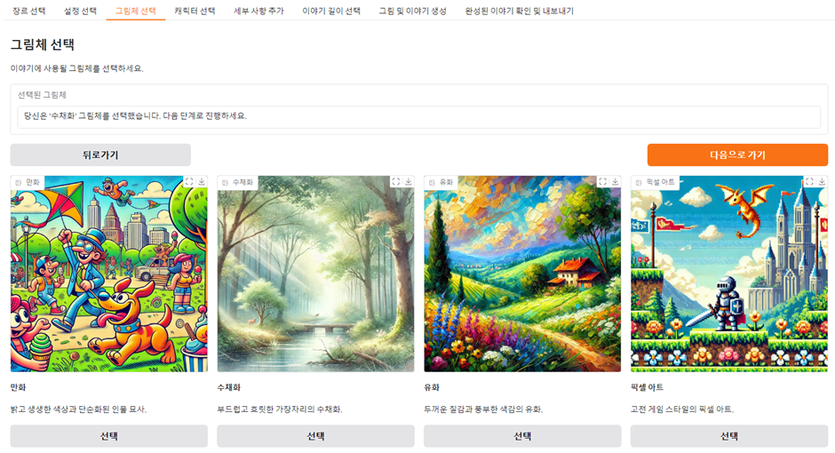
### 4단계: 캐릭터 선택
- 주인공의 이름, 성별, 나이, 특성을 입력하거나 랜덤으로 생성하세요.
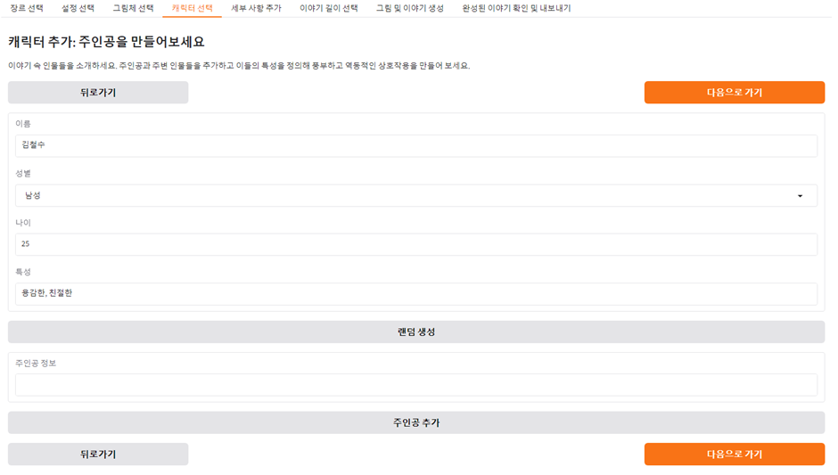
### 5단계: 스토리 아이디어 입력
- 원하는 이야기 아이디어를 입력하거나 이 단계는 건너뛸 수 있습니다.
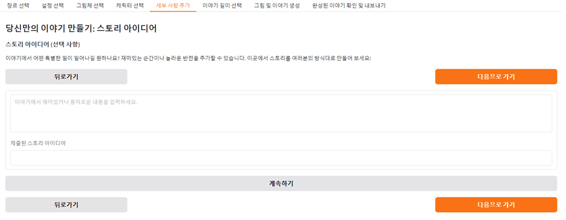
### 6단계: 이야기 길이 선택
- 짧은 이야기, 일반 이야기 중 하나를 선택하세요.
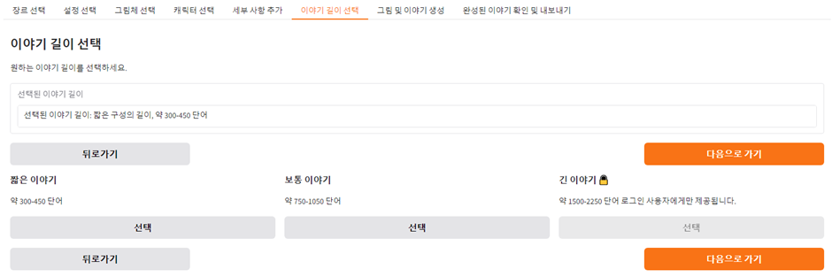
### 7단계: 이미지 및 이야기 생성
- 이미지를 업로드하여 AI가 이야기를 생성하고 새로운 이미지를 생성하도록 합니다.
- 생성된 이야기나 이미지는 재생성할 수 있습니다.
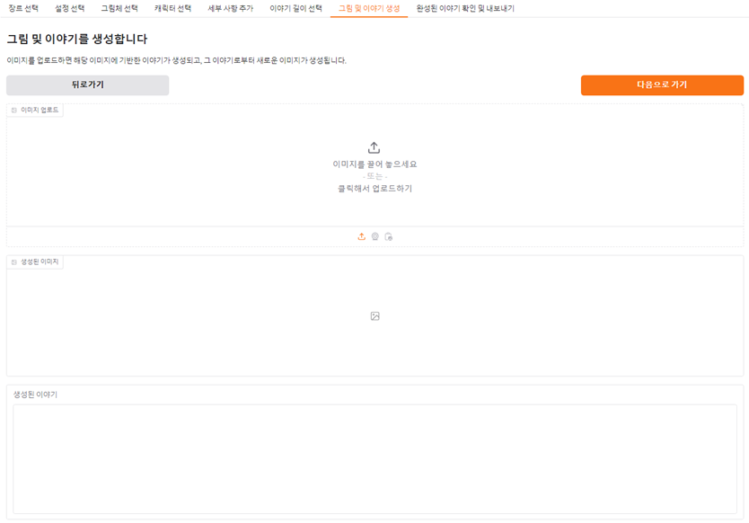
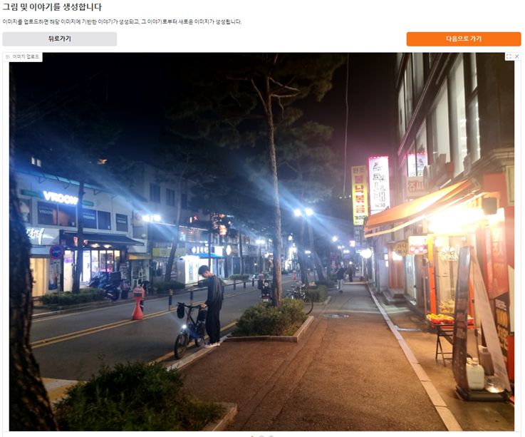
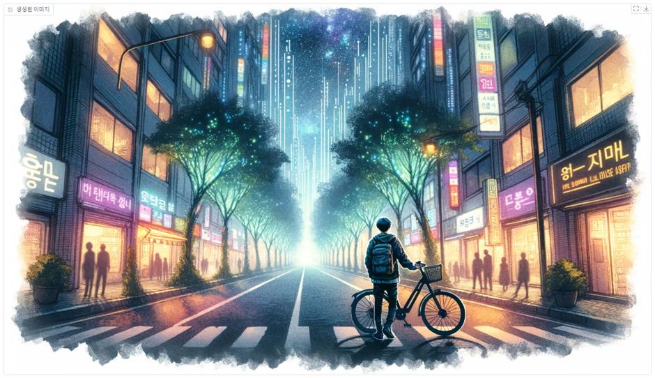
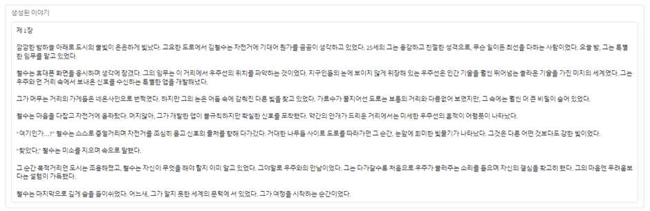
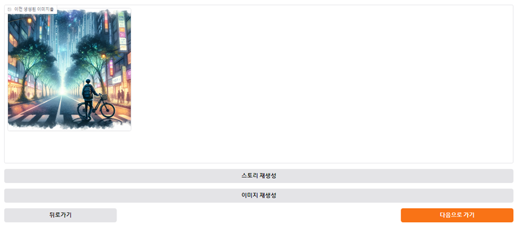
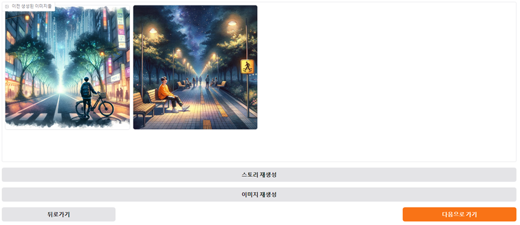
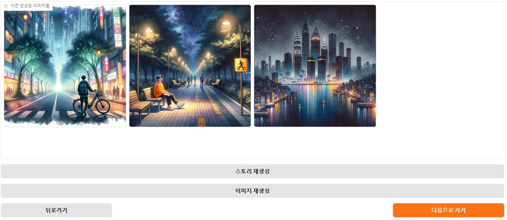
### 8단계: 내보내기 및 공유
- 생성된 이야기와 이미지를 PDF 또는 Word 파일로 내보내거나, 카카오톡 및 트위터를 통해 공유하세요.
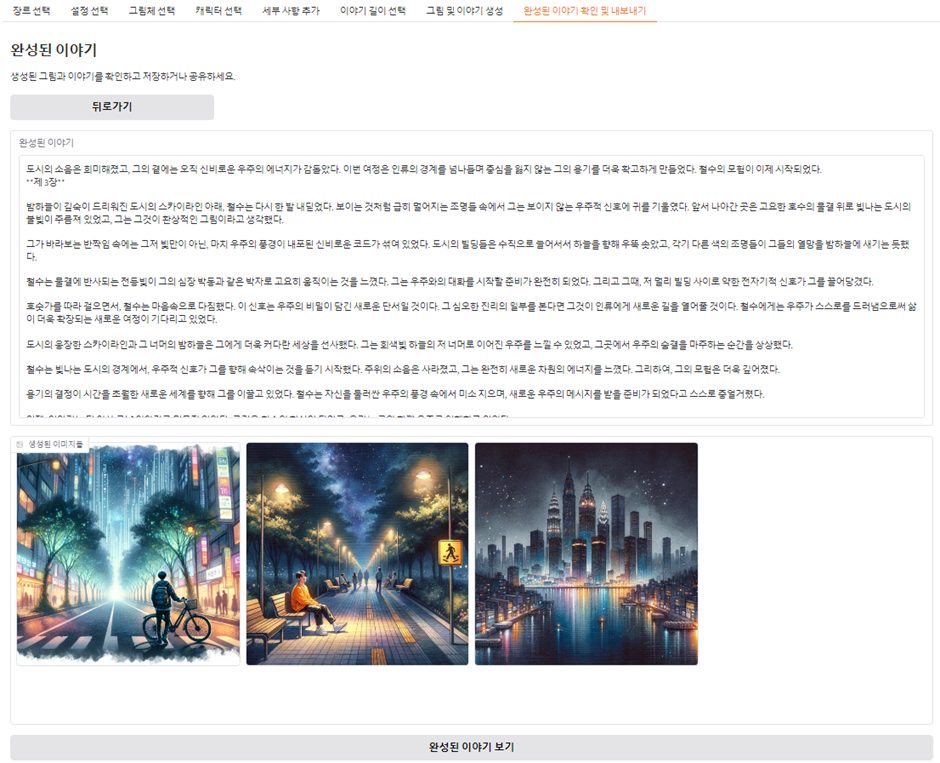
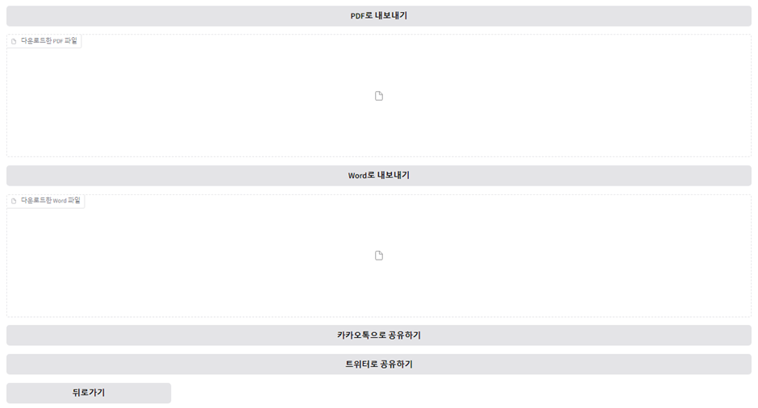
---

## 기여
본 프로젝트에 기여를 원하신다면 issues 탭을 통해 버그 리포트 및 피드백을 제출하거나, PR(Pull Request)을 보내주세요.

---

## 라이선스
본 프로젝트는 [MIT License](LICENSE) 하에 배포됩니다.